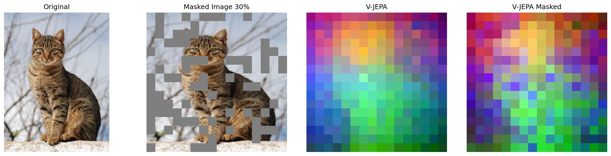

# vjepa2 PCA Visualization

This project contains scripts to visualize and analyze the features learned by the vjepa2 model using Principal Component Analysis (PCA).

## Description

This repository provides tools to:
- Visualize 2D and 3D PCA of VJepa features.
- Compare VJepa PCA with DINOv2 PCA.
- Analyze the effect of masking on VJepa features.

## Installation

1.  **Install `uv`:**

    Follow the official instructions to install `uv`:
    https://github.com/astral-sh/uv

2.  **Create a virtual environment:**
    ```bash
    uv venv
    ```

3.  **Activate the virtual environment:**
    ```bash
    source .venv/bin/activate
    ```

4.  **Install dependencies:**

    Install the required packages from `requirements.txt`:
    ```bash
    uv pip install -r requirements.txt
    ```

5.  **Install `transformers` from source:**

    The latest version of `transformers` is required, which is not yet available on PyPI. Install it directly from the GitHub repository:
    ```bash
    uv pip install git+https://github.com/huggingface/transformers
    ```

## Usage

### `2d_pca_vjepa_dinov2.py`

This script performs a 2D PCA on the features extracted from the vjepa2 and DINOv2 models and saves a comparison image.

```bash
python 2d_pca_vjepa_dinov2.py
```

### `3d_pca_vjepa.py`

This script visualizes the 3D PCA of vjepa2 features.

```bash
python 3d_pca_vjepa.py
```

### `vjepa2_masking_pca.py`

This script performs PCA on vjepa2 with masking and visualizes the results. You can specify the image path and the masking ratio.

```bash
python vjepa2_masking_pca.py --image_path images/wiki_cat_0.jpg --mask_ratio 0.3
```

### `main.py`

The main script to run the experiments.

```bash
python main.py
```

## Results

Here are some example output images generated by the scripts:

### PCA Comparison


### vjepa2 with 30% Masking (Cat 0)



### vjepa2 with 30% Masking (Cat 1)


### vjepa2 with 60% Masking (Cat 0)


### Block Mask


